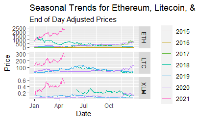
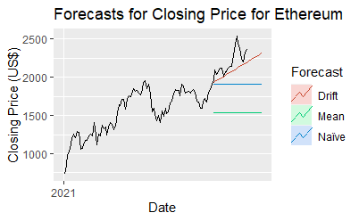
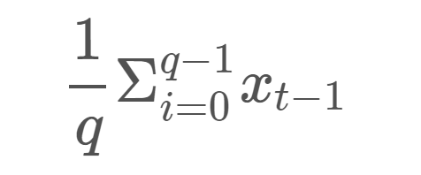
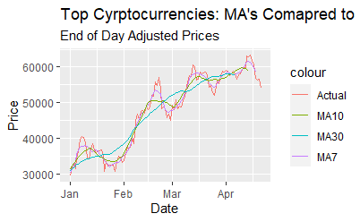
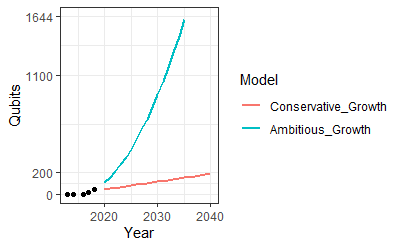
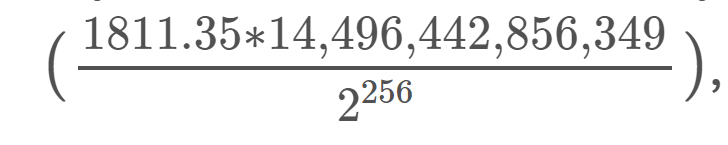
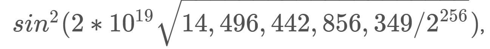

 

Don't know where to start or just looking for the quick overview? This is the page for you. This page borrows a little from all other sections on this site and delivers them in a small, palatable chunk.
 

*Introduction*
 
There is no debate that technological advancements have changed the face of investing. With growth comes new potential, and the recent interest in quantum computing opens up a cache of new opportunities. While conversations about quantum computing in the financial sphere often revolve around changes to encryption tactics and data security, this work posits that quantum computers will allow for additional changes to investing. Alongside developments to computing, new ways of investing have emerged, powered by more and more powerful machines. Cryptocurrency, specifically, has been an area of great growth and excitement, and the same technologies enable its existence as that of quantum computers.

This body of work pairs those two exiting innovations together, developing a framework for their mutual growth. 

*Cryptocurrency and Mining*
 
Cryptocurrency, to a degree, is exactly what it sounds like. It’s a form of “online money” that can be used like cash in many places, allowing you to exchange it for goods and services. Cryptocurrency uses a technology called “blockchain”. **Blockchain** uses a spread across many computers in order to manage and record transactions.

 *Image from PBS's Twitter*
 
 

In general, previous research has shown that methods for the prediction of cryptocurrency return poor performance. Cryptocurrency returns are very evidently non-normal, but there is no distribution to jointly fit all the cryptocurrencies– this fact presents a challenge to aspiring forecasters, and often requires different distributions to be imposed on specific currencies during periods of specific market conditions.

Here is a list of the most popular cryptocurrencies and their most recent price:

| Ticker | Currency     |Price (USD$) |
|--------|--------------|-------------|
| ADA    | Cardano      |$1.39 |
| BCH    | Bitcoin Cash |$547.65|
| BTC    | Bitcoin      |$39,766.64|
| DOGE   | Dogecoin     |$0.20|
| DOT    | Polkadot     |$19.31|
| ETH    | Ethereum     |$2,713.74|
| IOTA   | IOTA         |$0.88|
| LINK   | Chainlink    |$24.36|
| LTC    | Litecoin     |$144.01|
| TRX    | Tron         |$0.06|
| USDT   | Tether       |$0.99|
| XLM    | Stellar      |$0.28|
| XMR    | Monero       |$236.71|
| XRP    | Ripple       |$0.73|
| ZEC    | Zcash        |$119.75|

*Last Updated 08/08/2021 @ 1:30pm EST

If you don’t want to try your hand in the market, you have another choice. The purpose of mining is to introduce new cryptocurrency tokens into circulation.  It uses complex computers in order to solve complex, computationally-heavy mathematical problems.  

Tokens are a miner’s reward for completing “blocks” which are added to the blockchain. Finishing a block is not enough to earn a reward, as you must also be the first miner to arrive at the correct answer to the problem. The answer is called a **hash**, or a 64-digit hexadecimal number, and the “correct” hash is the one that is closest (less than or equal to) a target hash. There are trillions of possible combinations for a hash, so finding an efficient machine is essential to achieving any level of success.

 *Images from investopedia.com*
 
 

*Quantum Computing and Quantum Finance*
 
Quantum computers were designed with the main goal of massive speedups to computational problems. Whereas the common computer (we will call this “classic”) thinks about all its inputs and outputs in terms of 1s or 0s, a quantum computer can interpret information about objects that can be 1 **and** 0 simultaneously.

 *Image from planetvending.com*
 
 

Variables in a quantum space exist in **superposition**, where we can think of it as being held in multiple states at the same time (This isn't "technically correct", but it provides a good enough intuitive understanding).

Quantum computers are able to function at much greater speeds because instead of considering one possibility at a time, they can try all possible solutions in superposition (or, at the same time). 
There is no commercially available quantum computer, as their development is long and very expensive. However, quantum technologies are available without having to build the machine yourself. IBM allows access to its computers via the [IBM Quantum Network](https://quantum-computing.ibm.com/login). IBM plans to have a 1,000-qubit quantum computer in place by 2023.

Here is a picture of IBM's quantum computer:

 *Image from Venturebeat.com*
 
 

Quantum computers are especially useful for financial algorithms because they are able to take classic algorithms and apply them faster. For example, when applied to portfolio optimization, quantum algorithms can serve to help distribute the money between stocks in a way that would help use growth estimates and volatility to develop an investment strategy. 

This work will focus on Grover’s Algorithm, which was developed as a mechanism for searching an unstructured database. Grover’s Algorithm is of special interest when discussing cryptocurrency as it demonstrates a threat to cryptographic hashing, and thus to blockchain integrity and block mining. 

*Grover's Algorithm*
 
The Grover Algorithm is a search function which returns “True” for one of its possible inputs, and “False” for all the others; its purpose is to find any object in the database that would return “True”. In addition, it can be used to perform exhaustive searches over the set of possible solution. It is the fastest possible quantum algorithm for searching an unsorted database. 

In classical computation, the search (on average) would require checking $N/2$ items, and at worst all $N$ items. On a quantum computer, however, we can find the marked item in roughly $\sqrt{N}$ steps with Grover’s algorithm, which is a significant improvement to computational efficiency. Since the algorithm does not depend on the structure of the database itself, it can be used more generically. It is fast because it does not have to search for a variable in a sequential order, but can instead work in parallel to consider all possibilities at the same time.

*The Cryptocurrency Market Analysis*
 

In order to speak intelligently on cryptocurrency, it is imperitive that we understand the market which it inhabits. 

All data in this portion of the analysis was gathered from https://www.coindesk.com/price/ (updated: 08/04/2021). 

Variables of interest are Currency, Date, Closing Price, the 24h High, and the 24h Low.

In current conditions, Bitcoin is so comparatively expensive that it is hard to gauge the other currencies. As a result, it won't be included in the following price chart.
 

 

Visually, we notice that after a slump over the last two years, cryptocurrency is again regaining popularity very quickly. The questions are: 

1. How quickly?
2. For how long? &
3. With which type of growth (Quadratic? Exponential? Polynomial?)? Overall, is now a good time to be investing in or mining cryptocurrency?

Most human activities have some sort of seasonality. However, it can be inconsistent when it comes to the stock market. Here as well, regardless of which currency we choose, it is hard to parse out a consistent seasonal pattern. In some years, it looks like price picks up in the middle of the year, while in others the growth is seen at the tails. Since trading is highly responsive to the social climate of the time, it makes sense that season alone isn't enough to predict pricing. Consecutive closing values appear not to follow one another closely, suggesting an autoregression model for prediction would likely be appropriate, as it often is for stocks. 
 

 

The next step was then to  measure to see how well 3 of the most simplistic financial models performed in comparison against the actual value and against each other using the MAPE, or mean absolute percentage error. We want the lowest error values, so the "drift" forecast seems to be the best. A **drift model** is dependent on the average slope between the first and final observations. It tends to work well when the market is heading steadily in a single direction. However, none of the 3 were good estimates, and we expect to outperform them even with simple machine learning models.

 

|**Average Method**|  MAPE|
|-------------|--------------|
|Training set | 17.88|
|Test set     | 29.67|
|**Naïve Method**|  |
|Training set | 4.70|
|Test set     | 29.67|
|**Drift Method**|  |
|Training set | 4.59|
|Test set     | 6.01|

When attributing a certain type of growth to the cryptocurrencies seen in the analysis, it is unsurprising that the growth seemed to follow an exponential pattern. However, attributing cryptocurrency price to exponential growth only explains about 7% of the variance. We didn't expect time alone to be enough to unlock the secrets of the stock market, so it is hardly surprising that we get poor results when conditioning primarily on time. 

But the real question here is whether we can make money in the cryptocurrency market. The first thing we can do to determine how long is the market trending up/down is create a **simple moving average (MA)** or **rolling mean**  for each stock. This is done to make identifying trends easier and to smooth noise from the data set. As we increase the number of days we average over, the MA's responsiveness to price variation decreases. The formula for the MA is as follows:
 

 
where *q* is the number of days considered, from a series $x_t$ during time period *t*.

Here is an example of what this would look like for Bitcoin in 2021 for 7, 10 and 30 day averages:

Using this data, we built a very simple buy/sell indicator. We would "buy" when MA7 crosses over MA30 upwards and sell when MA7 crosses MA30 downwards. We could build this trigger using Python, and it would work well, for a while. Overall, this model made 197% in profit in the period 01/02 and 04/05 of 2021. This totals 8 transactions (4 each of Buy/Sell). Of these 8 transactions, the model would have made the correct choice (as compared to the actual market rise/fall) 7/8 (87.5%) times.

One word of caution, however, is that the MA made money because it did not have to account for a sign change in the slope. If the market turned and Bitcoin prices declined while the algorithm was running, the MA model would have lost money. In order to be a safe way to make money, there has to be a built-in trigger. If the slope has changed sign for three consecutive measurements, we would instead buy when the difference was negative and sell when the difference turned positive.

In short, if this forecasting model can make money, imagine what we could do with a more complex model or heftier technology Given current market conditions, this MA model outperforms even Simple Exponential Smoothing (SES) or Autoregressive Integrated Moving Average (ARIMA) models. Overall, it looks like we are expecting an upward trend for cryptocurrency for a little while longer. 

So, let's say that we decide we want to invest in cryprocurrency but don't have the funding. What can we do?

*Putting the Pieces Together*
 
As of this post, the reward is 6.25 BTC for finishing a block. Since the price is at 39,766.64 dollars, this amounts to a total of 248,541.50 USD. The time it takes to find a hash is controlled for difficulty ever 2016 blocks, but it take a single miner (on average) about 5 years to finish a block. It is important to keep in mind that this number includes people with complex mining rigs and those with a more simplistic approaches to hashing. Still, the potential to make 49,708.30 dollars a year (before expenses) is enough to incentivize many hopeful miners.

In order to mine cryptocurrency, we need to to find a specific (or smaller) sequence of 64 letters and numbers. Cryptocurrency mining involves repeatedly changing our guess until we find a sequence that works. On a classic computer, this can only be done using exhaustive, brute force methods. This takes a long time and is difficult to do, hence the high rewards for success.

For each position of the 64, there are 16 possibilities: 0 though 9 and a, b, c, d, e, and f. At the moment, we also know that the first 8 to 64 positions must be "0". Our chances of guessing every digit correctly is $\frac{1}{16^{n}}$, where n=48. This is a tiny probability. For a your typical home computer to find this number, it would take would take thousands of years to mine a new block. However, with mining camps and supercomputers, the real number of iterations can be fewer. Nowadays, Bitcoin is designed to be adaptive in difficulty, and one new block is found on average every 10 minutes or 600 seconds. 

A quantum computer can lead to a huge advantage. Recall, Grover offers us a speedup from for a database of N to √N. Imagine that we can try 0-f on our first digit at the same time. Likewise, for every subsequent digit, the quantum computer can try all the possibilities in parallel. 

Classically, the probability of successfully mining a block via random guess is given by $\frac{Trt}{2^{256}}$, where r is the hash rate (the number of guesses made per second), t is the time (seconds), and T is the "adaptive difficulty" mentioned above, which can be computed using the number of hashes equal or less than the target. It is intuitively understood that the faster you can guess, the faster you can find a solution.
On a quantum computer using Grover, we can represent the equation for Bitcoin mining as $sin^{2}(2r_{q}t\sqrt{T/2^{256}})$
where $r_{q}$ is the quantum hash rate, determined by the number of Grover iterations per second.

However, there is a big question in regard to whether existing quantum computers can handle the computational load, and if they can't, when one might be available.

For this forecasting, I used two different data sets. The first was a list of quantum computers and their number of qubits, along with the year. This data looks like this:

| Number of Qubits | Year| Quantum Computer |
|--------|--------------|-------------|
| 2    | 2013 |IBM |
| 5    | 2014 |UC Santa Barbara|
| 3    | 2014 |IBM|
| 5    | 2016 |IBM|
| 16   | 2017 |IBM|
| 20   | 2017 |Google|
| 49   | 2018 |Google|
| ...  | ...  |...|

The second data set was taken from [blockchain.info](https://www.blockchain.com/charts/hash-rate?timespan=all&daysAverageString=7&scale=1) and used to model hashing power of each computer. 
The first series of predictive models found that qubit growth has been historically exponential and such a model is still the best fit. We found that the estimate for ambitions growth will see the number of qubits double every year while the conservative estimate believes it to double every two years. I fit a model to the original data and then generated the two precitions of varying strictness.

By our computation, we expect:

| Number of Qubits (Min) | Number of Qubits (Max)     | Year |
|--------|--------------|-------------|
| 82    | 420 |2025|
| 117    | 919      |2030|
| 153    | 1610      |2035 |
| 189    | 2494 |2040|
| ...   | ...      |...|

When modeling hashing power for a quantum computer, the conservative estimate was generated assuming we continue at the current rate of growth linearly, and the aggressive estimate uses exponential increases for the first 5 years. Here, I used time series techniques and exponential smoothing forecasting methods.

We found that hash rate also shows exponential growth and that the technology will be available shortly such that it will allow us an advantage over classic mining techniques. By 2025, we will have access to quantum computers strong enough (min. 1e+19 hash rate) and large enough (min. 82 qubits). This will allow quantum computers to be competitive against even resistant Bitcoin networks and add an advantage to mining through quadratic speedups due to parallel processing.

The only thing left is to compute my current probability of success for mining a Bitcoin. My chances of successfully mining a block on my laptop would be about

or 2.268e-61, while my chances of doing to on a quantum computer with a 2020 hash rate would be about  

or 5.01e-26. Those both are very small numbers, but the quantum version is performing 200% better than the classic version. That's  statistically significant advantage.

*Limitations*
 
There are some things that get in the way of this being a "perfect solution". Current iterations of quantum computers have a lot of calculation error. Furthermore, since Bitcoin miners have become highly specialized, they can be extremely fast compared to even quantum computers. Finally, it should be mentioned that we talk about using quantum computers in a **legal** way to honestly mine cryptocurrency. There is a real danger that quantum computers will enable hackers to *steal* finished blocks from individuals with real computers. 

*Conclusion*
 
Bitcoin is built on cryptography, and neither cryptocurrency nor quantum computing are going to be left behind in this technological arms race. The benefits (and threats) of quantum computing on searching and code breaking should not be undervalued, and as this technology continues to grow, so will the opportunities. Even at today’s computational level, a quantum computer could give someone a 200% increase to their success rate in cryptocurrency mining. There is enormous potential in these devices, and the responsibility is on us to use them responsibly.  It is certainly an exciting endeavor, and I look forward to seeing how these technologies involve in tandem.

What are your impressions? Read some closing thoughts on quantum computing and cryptocurrency [here](https://amoderninvestor.netlify.app/21/2021/01/). Or, click [here](https://amoderninvestor.netlify.app/) to return to the main page and explore the topics more deeply.

*Image from Stanford.edu*