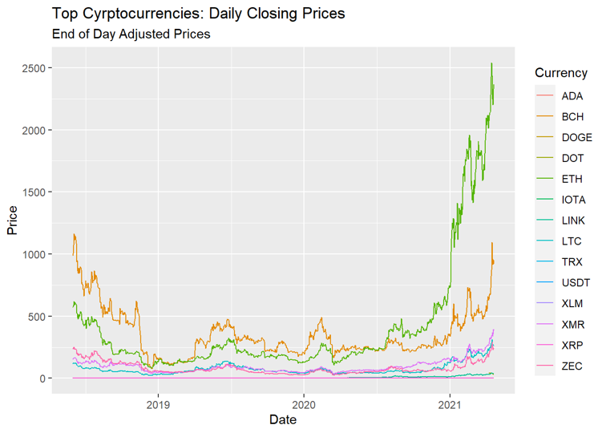

 

Don't know where to start or just looking for the quick overview? This is the page for you. This page borrows a little from all other sections on this site and delivers them in a small, palatable chunk.
 

*Introduction*
 
There is no debate that technological advancements have changed the face of investing. With growth comes new potential, and the recent interest in quantum computing opens up a cache of new opportunities. While conversations about quantum computing in the financial sphere often revolve around changes to encryption tactics and data security, this work posits that quantum computers will allow for additional changes to investing. Alongside developments to computing, new ways of investing have emerged, powered by more and more powerful machines. Cryptocurrency, specifically, has been an area of great growth and excitement, and the same technologies enable its existence as that of quantum computers.

This body of work pairs those two exiting innovations together, developing a framework for their mutual growth. 

*Cryptocurrency and Mining*
 
Cryptocurrency, to a degree, is exactly what it sounds like. It’s a form of “online money” that can be used like cash in many places, allowing you to exchange it for goods and services. Cryptocurrency uses a technology called “blockchain”. **Blockchain** uses a spread across many computers in order to manage and record transactions.

 *Image from PBS's Twitter*
 
In general, previous research has shown that methods for the prediction of cryptocurrency return poor performance. Cryptocurrency returns are very evidently non-normal, but there is no distribution to jointly fit all the cryptocurrencies– this fact presents a challenge to aspiring forecasters, and often requires different distributions to be imposed on specific currencies during periods of specific market conditions.

Here is a list of the most popular cryptocurrencies and their most recent price:

| Ticker | Currency     |Price (USD$) |
|--------|--------------|-------------|
| ADA    | Cardano      |$1.39 |
| BCH    | Bitcoin Cash |$547.65|
| BTC    | Bitcoin      |$39,766.64|
| DOGE   | Dogecoin     |$0.20|
| DOT    | Polkadot     |$19.31|
| ETH    | Ethereum     |$2,713.74|
| IOTA   | IOTA         |$0.88|
| LINK   | Chainlink    |$24.36|
| LTC    | Litecoin     |$144.01|
| TRX    | Tron         |$0.06|
| USDT   | Tether       |$0.99|
| XLM    | Stellar      |$0.28|
| XMR    | Monero       |$236.71|
| XRP    | Ripple       |$0.73|
| ZEC    | Zcash        |$119.75|

*Last Updated 08/08/2021 @ 1:30pm EST

If you don’t want to try your hand in the market, you have another choice. The purpose of mining is to introduce new cryptocurrency tokens into circulation.  It uses complex computers in order to solve complex, computationally-heavy mathematical problems.  

Tokens are a miner’s reward for completing “blocks” which are added to the blockchain. Finishing a block is not enough to earn a reward, as you must also be the first miner to arrive at the correct answer to the problem. The answer is called a **hash**, or a 64-digit hexadecimal number, and the “correct” hash is the one that is closest (less than or equal to) a target hash. There are trillions of possible combinations for a hash, so finding an efficient machine is essential to achieving any level of success.

 *Images from investopedia.com*
 

*Quantum Computing and Quantum Finance*
 
Quantum computers were designed with the main goal of massive speedups to computational problems. Whereas the common computer (we will call this “classic”) thinks about all its inputs and outputs in terms of 1s or 0s, a quantum computer can interpret information about objects that can be 1 **and** 0 simultaneously.

 *Image from planetvending.com*
 

Variables in a quantum space exist in **superposition**, where we can think of it as being held in multiple states at the same time (This isn't "technically correct", but it provides a good enough intuitive understanding).

Quantum computers are able to function at much greater speeds because instead of considering one possibility at a time, they can try all possible solutions in superposition (or, at the same time). 
There is no commercially available quantum computer, as their development is long and very expensive. However, quantum technologies are available without having to build the machine yourself. IBM allows access to its computers via the [IBM Quantum Network](https://quantum-computing.ibm.com/login). IBM plans to have a 1,000-qubit quantum computer in place by 2023.

Here is a picture of IBM's quantum computer:

 *Image from Venturebeat.com*
 

Quantum computers are especially useful for financial algorithms because they are able to take classic algorithms and apply them faster. For example, when applied to portfolio optimization, quantum algorithms can serve to help distribute the money between stocks in a way that would help use growth estimates and volatility to develop an investment strategy. 

This work will focus on Grover’s Algorithm, which was developed as a mechanism for searching an unstructured database. Grover’s Algorithm is of special interest when discussing cryptocurrency as it demonstrates a threat to cryptographic hashing, and thus to blockchain integrity and block mining. 

*Grover's Algorithm*
 
The Grover Algorithm is a search function which returns “True” for one of its possible inputs, and “False” for all the others; its purpose is to find any object in the database that would return “True”. In addition, it can be used to perform exhaustive searches over the set of possible solution. It is the fastest possible quantum algorithm for searching an unsorted database. 

In classical computation, the search (on average) would require checking $N/2$ items, and at worst all $N$ items. On a quantum computer, however, we can find the marked item in roughly $\sqrt{N}$ steps with Grover’s algorithm, which is a significant improvement to computational efficiency. Since the algorithm does not depend on the structure of the database itself, it can be used more generically. It is fast because it does not have to search for a variable in a sequential order, but can instead work in parallel to consider all possibilities at the same time.

*The Cryptocurrency Market Analysis*
 

 

*Putting the Pieces Together*
 
In order to mine cryptocurrency, we need to to find a specific (or smaller) sequence of 64 letters and numbers. Cryptocurrency mining involves repeatedly changing our guess until we find a sequence that works. On a classic computer, this can only be done using exhaustive, brute force methods. This takes a long time and is difficult to do, hence the high rewards for success.

For each position of the 64, there are 16 possibilities: 0 though 9 and a, b, c, d, e, and f. At the moment, we also know that the first 8 to 64 positions must be "0". 

For a your typical home computer to find this number, it would take would take thousands of years to mine a new block. However, with mining camps and supercomputers, the real number of iterations can be fewer. Nowadays, Bitcoin is designed to be adaptive in difficulty, and one new block is found on average every 10 minutes or 600 seconds. 

Recall, Grover offers us a speedup from for a database of N to √N. Imagine that we can try 0-f on our first digit at the same time. 

*Limitations*
 
There are some things that get in the way of this being a "perfect solution". Current iterations of quantum computers have a lot of calculation error. Furthermore, since Bitcoin miners have become highly specialized, they can be extremely fast compared to even quantum computers. Finally, it should be mentioned that we talk about using quantum computers in a **legal** way to honestly mine cryptocurrency. There is a real danger that quantum computers will enable hackers to *steal* finished blocks from individuals with real computers. 

*Conclusion*
 
Bitcoin is built on cryptography, and neither cryptocurrency nor quantum computing are going to be left behind in this technological arms race. The benefits (and threats) of quantum computing on searching and code breaking should not be undervalued, and as this technology continues to grow, so will the opportunities. Even at today’s computational level, a quantum computer could give someone a 200% increase to their success rate in cryptocurrency mining. There is enormous potential in these devices, and the responsibility is on us to use them responsibly.  It is certainly an exciting endeavor, and I look forward to seeing how these technologies involve in tandem.

What are your impressions? Read some closing thoughts on quantum computing and cryptocurrency [here](https://amoderninvestor.netlify.app/21/2021/01/). Or, click [here](https://amoderninvestor.netlify.app/) to return to the main page and explore the topics more deeply.

*Image from Stanford.edu*