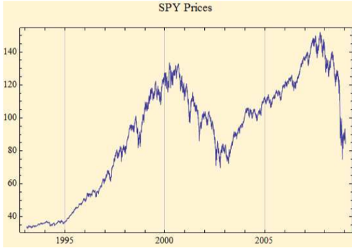
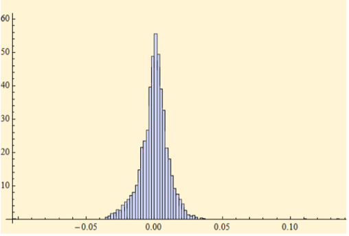

 

# Overview

For a long time, it had been easy to overlook cryptocurrency as a serious investment (Exhibit A: Dogecoin). However, with a new upswing in popularity, cryptocurrency values have been on the rise again. With the cryptocommunity attracting attention from investors, this project seeks to launch a timely exploration into modeling trends in the world of virtual currency. The data set presented in this project tracks the daily closing price of the 15 most popular cryptocurrencies available for purchase, including Bitcoin and Ethereum; after exploring several more common machine learning models for finance, this project begins to develop upon a new methodology for model aggregation for cryptocurrency.

One means by which we can attempt to create a more inclusive model for cryptocurrency is through creating a means of introducing uncertainty into deterministic models with performance superior to stand-alone Monte Carlo-based sampling techniques. In practice, we know that stock market return rates do not necessarily follow a Gaussian distribution (and we have reason to suspect that cryptocurrency behaves in a very similar way). As seen with stocks, the Black Scholes construction remains a viable method in such a scenario as described above so long as expected values of truncated distributions are finite (which is not imediately evident in Monte Carlo methods). 

# Context

Understanding how Bitcoin and other cryptocurrencies work is important since they represent an asset completely embedded in a decentralized market. At the moment, there exist several thousand cryptocurrencies that constitute a multi-billion market (Hu, 2019). In general, previous research has shown that methods for the prediction of cryptocurrency return from poor performance. Cryptocurrency returns are very evidently non-normal, but there is no distribution to jointly fit all the cryptocurrencies-- this fact presents a challenge to aspiring forecasters, and often requires different distributions to be imposed on specific currencies during periods of specific market conditions.

Results from an exploration like this would have application in investment, academic, and risk management settings. While contemporaneous-type prediction models hols academic interest, trade-able results require a bit more complexity. Furthering the understanding of cryptocurrency would allow for greater portfolio optimization and risk diversification. Not much literature exists in this area yet, and while publications on the topic of 	cryptocurrency started appearing in 2017, most papers using any sort of Mathematical-	Statistical Approach or Machine Learning Model were published in the last year (2020).

### Potential Resources:
- Chan, S., Chu, J., Nadarajah, S., & Osterrieder, J. (2017). A statistical analysis of cryptocurrencies. *Journal of Risk and Financial Management*, 10(2), 12.
- Lamothe-Fernández, P., Alaminos, D., Lamothe-López, P., & Fernández-Gámez, M. A. (2020). Deep Learning Methods for Modeling Bitcoin Price. *Mathematics*, 8(8), 1245.
- Grunspan, C., & Pérez-Marco, R. (2020). The mathematics of Bitcoin. *arXiv preprint arXiv:* 2003.00001.

Our financial data is limited, and models tend to work best when considering a truncated time frame. This second proposal focuses more on an approach of arithmetically combining variables; we were to repeatedly run a model with sets of random values chosen from the  variables representing the model inputs, then likely outcomes would necessarily occur most often. More to the point, we would spend most of the model runs in an effort to observe the likely outcomes; a more significant issue arises when we consider unlikely outcomes.

Consider a model the predicts patient outcome when given a certain drug. For simplicity suppose that the output of this model is success (patient survives) or failure (patient dies). If the true likelihood of failure is 1 in 1 billion, then we expect to run a randomized-input type model at one billion times to observe a single failure. To be confident the single observation of failure is one in one billion we need to run the model many times one billion runs so that several failures are observed. Using computational effort (time and hardware resources) as a proxy for importance of outcome we see that the randomized-input approach attaches nearly no importance to the most significant outcome, patient death in this case.

My knowledge of financial math is more of a *dream*, but I **think** that we can use this type of analysis to advance research in cryptocurrency.

Here is how, demonstrated on a regular stock:
Let's say we have historical data for "SPY". I can theoretically build on the work on Levy-Stable distributions by Nolan (2010) which takes the daily prices of this particular stock (ticker: SPY). Following the Black Scholes construction, the share price of SPY at T = one day in the future is denoted ST which is defined as ST = 80 × LNS, if the current price was $80 a share and LNS denotes the LogNormal-LevyStable distribution given the fit data found by Nolan. I can then recover the probability distribution at this ST (or any ST) and define the payoff random variable of a 1-day European-style call option (or put option).

The point of the example would be to demonstrate that the call option would have both a discrete and a continuous distribution. This would force Black Scholes to fail, as the expected value of the continuous portion would be infinite. This highlights the issue with assuming that real-life return rates are Gaussian. What we can do with this knowledge as it applies to cryptocurrency will be discussed below in the "Methods" section.

- Nolan, J. (2010). Bibliography on stable distributions, processes and related topics. In *Technical Report*.

 
SPY stock price and stock price daily return distribution

# Proposal

### Goal:
The ultimate goal of this model is to contribute an aggregate methodology for cyrptocurrency modeling that outperforms the most common standalone models for finance (ARIMA, for example). The revised version of this proposal sees this happening as a consequence of a new approach to recovering a distribution, which is often assumed to be Gaussian in classic financial algorithms. This project will employ Geometric Black Scholes Pricing and Monte Carlo Techniques.

### Methods:
The price data for the “closing price” for each of the top 15 cryptocurrencies will be pulled daily and added to the dataset. The currencies would include: Cardano, Bitcoin Cash, Bitcoin, Dogecoin, Polkadot, Ethereum, IOTA, Chainlink, Litecoin, Tron, Tether, Stellar, Monero, Ripple, & Zcash. All data is gathered from: https://www.coindesk.com/price/

Available variables are: Currency, Date, ClosingPrice, 24hOpen, 24hHigh, & 24hLow

One important note: cryptocurrency can be bought or sold at any time, including weekends or nights. Thus, it is not necessary to make any calendar adjustments as we would to stock market data. This data is unique in the fact that our only predictive variable is time. In the future, it might be worthwhile to improve the model incorporating outside variables, such as whether a particular cryptocurrency is being mentioned more often on Twitter.

Models for initial exploration include a mix of traditional time series forecasting methods (ARIMA, Regression, Bayesian Regularization), and Machine Learning techniques (Support Vector Machines (SVM) and Artificial Neural Networks (ANN), PCA, etc.). This is largely already completed, and has shown difficulty in reacting dynamically to change. As of this moment, the strongest version of the algorithm relies heavily on the moving average of any particular cryptocurrency, and performs very well...  until the slope of the stock changes. So instead, I'll see how well respected financial models fare with cryptocurrency once given a few adjustments.

<u>On hold:</u> "While the majority of the available data is related to price (daily high/low, % change, trading volume, etc.), it may be helpful and enlightening to supplement the financial data with external factors. This could include sentiment analysis, event adjustments, US economic information, or other related variables."

Finally, most human activities have some sort of seasonality. However, it can be inconsistent when it comes to the stock market. This data suggests a trend or seasonal pattern (as this project will show), but this report does not plan to discuss time series decomposition in depth.

Past what has already been done this project will now (likely) begin with an uncertainty, sensitivity and risk analysis in the standard approach of assigning a probability distribution to each model input to represent its uncertainty. The application of this project will use the Black Scholes construction to illuminate and demonstrate the limitations of Monte Carlo techniques when applied to stock market data. More theoretically, this work asks “what if” we re-constructed our reference model to allow for random variables in place of numerical values and ran the entire model with this substitution. To accomplish this goal of substituting random variables for real-valued model inputs it is necessary to extend the established theory of functions of random variables. This theory extension will go far enough to include functions we find not only in the reference model, but in general business-style models. By considering model implementation (as opposed to black-box thinking where only model outputs are captured), contrasting results of model analysis will be obtained.

### Outcomes:
Ultimately, in order to make progress in this field, I should be able to find a combination of existing methods or develop an alternate proposal for a model which can be applied to cryptocurrency prices.

In this moment, a simple moving average performs surprisingly well in predicting cryptocurrency price, but it is highly volatile and does not adapt well to unexpected market movement. 

# Conclusion

As cryptocurrency continues to grow in popularity and attract attention from investors and academics, the need for more rigorous prediction models has become evident. Capitalizing on a gap in existing literature, this project looks to aggregate machine learning techniques in order to develop a more accurate approach to forecasting cryptocurrency price.The subject is not only interesting and potentially profitable, but is also a hot topic in publishing right now.

As before, this model will be designed for a specific set of cryptocurrencies, but as it accounts for more general conditions, it could be applied to other currencies or financial trends.

This project could grow into a framework for autonomous trading, but at the same time could be limited by an algorithm's difficulty adapting to single, traumatic market events. The true challenge would be to see if we can outperform trading calls made by human judgment.

# Don't let this be you!
	

